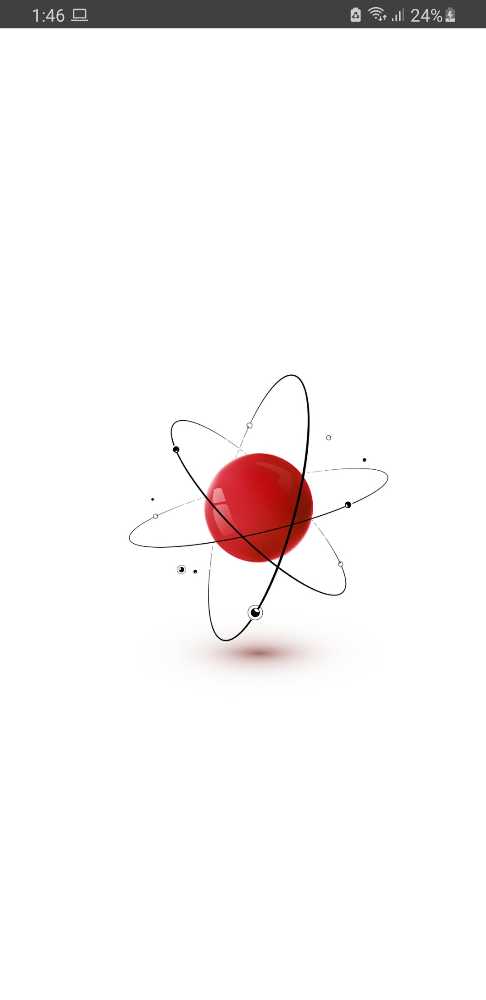
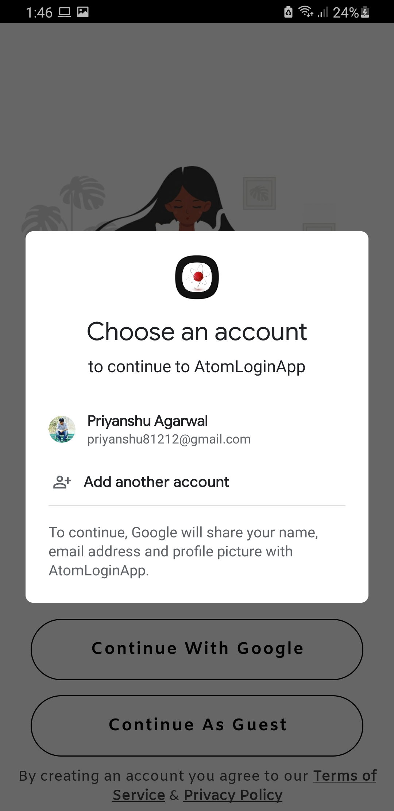

# AtomLoginApp
## Internship Assignment for Selection

## Solution

| | | |
|:-------------------------:|:-------------------------:|:-------------------------:|
|  Splash Screen |  Login Screen |  Loading Services 
|  Google Sign-In  |   Registration Screen |  Home Screen |

### Summary
For creation of this app, I have used following practices/libraries : 
  - MVVM Architecture
  - Dagger-Hilt for Dependency Injection
  - Firebase for Authentication
  - DataStore Preferences to store login details in local storage
  - Navigation Component for navigation
  
